<h1 align="center">:computer::spider::closed_lock_with_key:Penetration Testing - Penetration Testing on Metasploitable 2</h1>

  
  
  

  This project involves a comprehensive penetration testing scenario targeting a Metasploitable 2 virtual machine using Kali Linux.
  The process includes host discovery with Netdiscover and Nmap, vulnerability scanning with Nessus, and exploitation using the Metasploit Framework.
  Post-exploitation activities such as data extraction via Netcat and traffic monitoring with Wireshark are also performed.
  Key technologies used in the project include VirtualBox, Kali Linux, Metasploitable 2, Metasploit, Nessus, Wireshark, DB Browser for SQLite, Netcat, and Nmap.

## :camera_flash: Screenshots

### :arrow_down: 1. Installing Virtual Machines
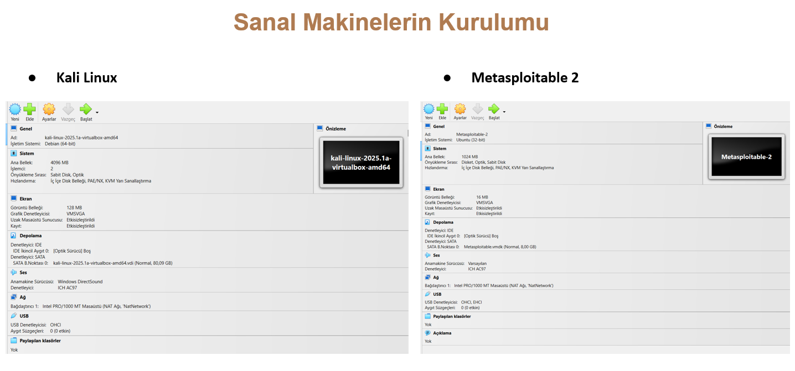

### 📊 2. Metasploitable 2 Login Page and IP Address
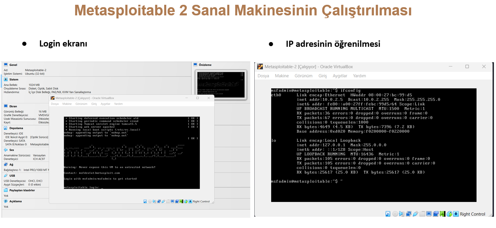

### :arrow_down: 3. Nessus Installation
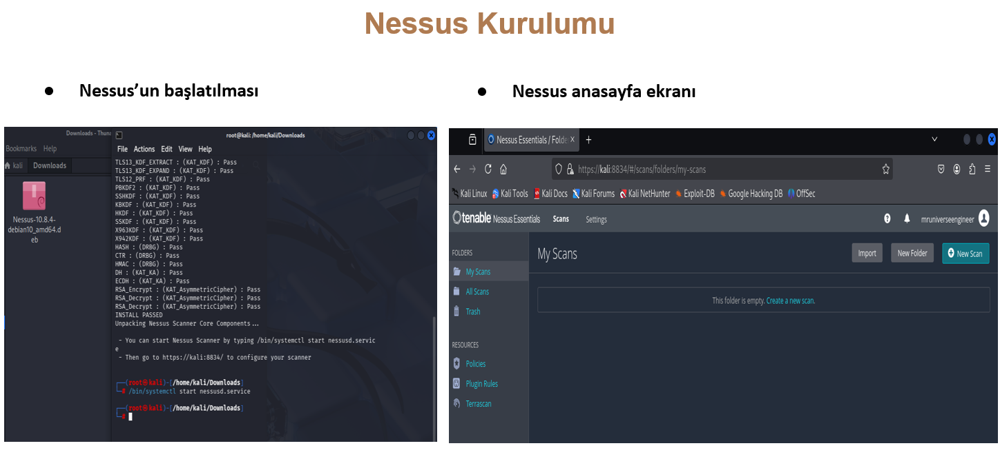

### 🔍 4. Discovery of Devices on the Network
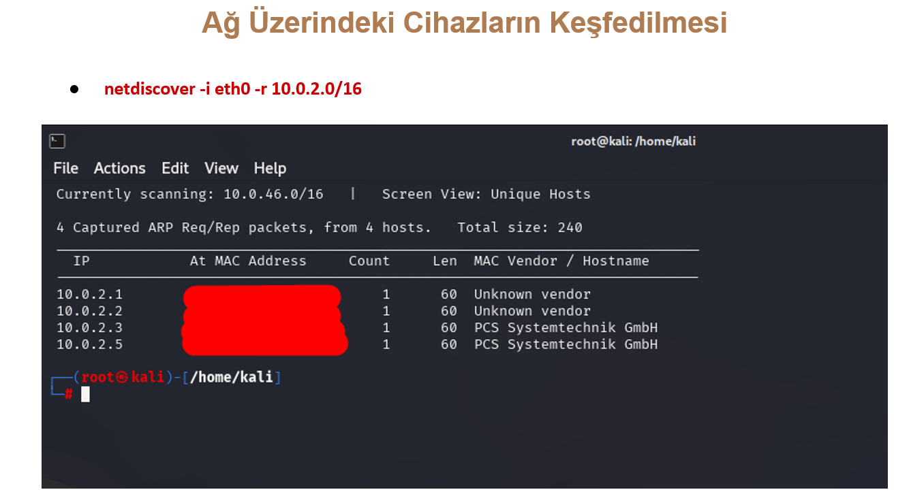

### 📊 5. Port and Service Scanning with Nmap
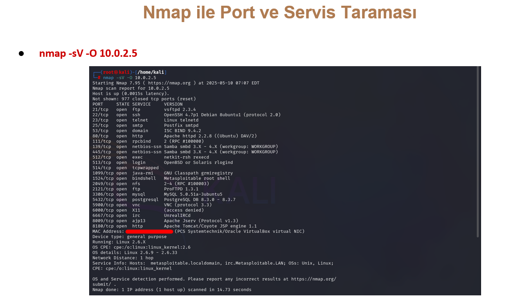

### 🛡️ 6. Vulnerability Scanning with Nessus
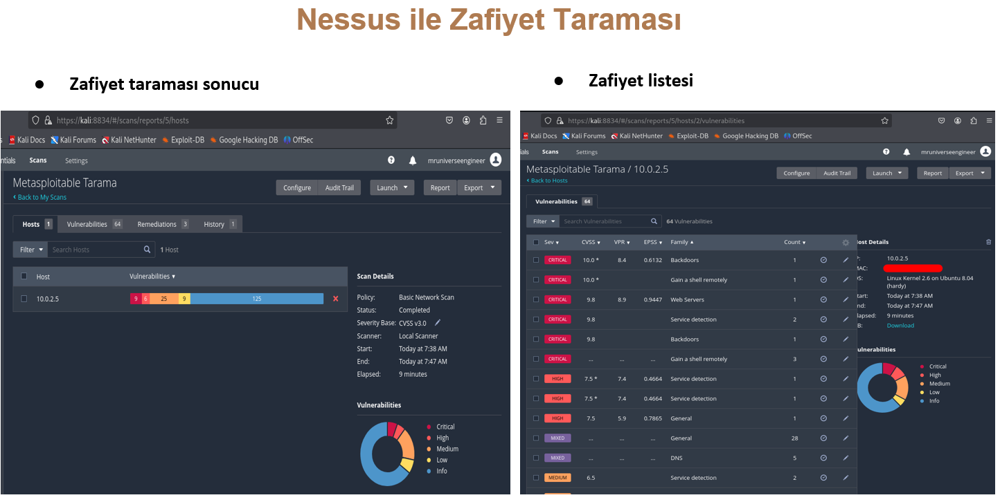

### 🛡️ 6. Nessus - Vulnerability Detail
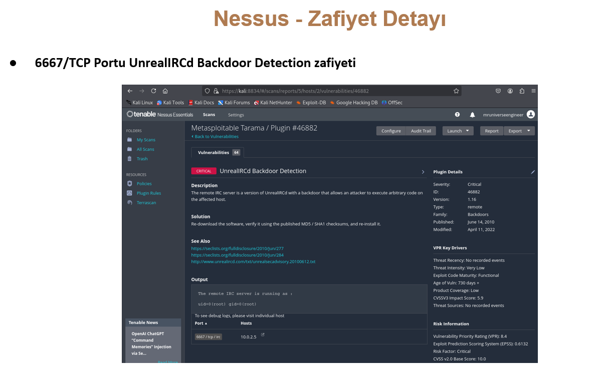

### 🧠 7. Monitoring Network Traffic With Wireshark
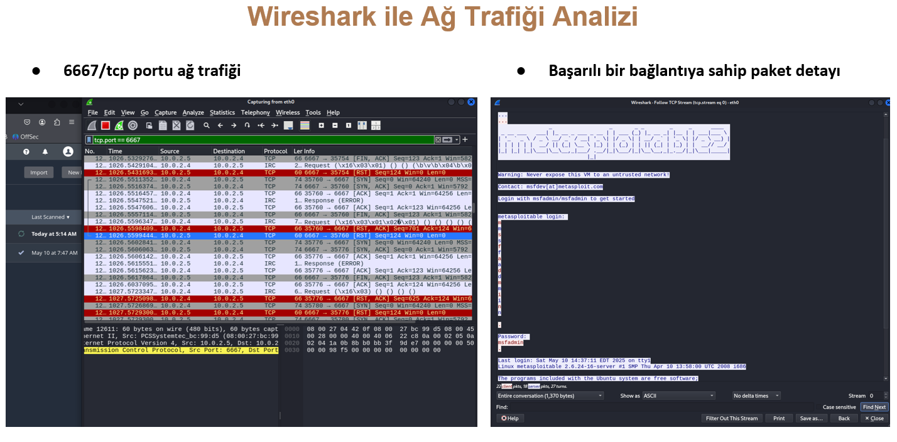

### 💣 8. Metasploit Exploit Usage
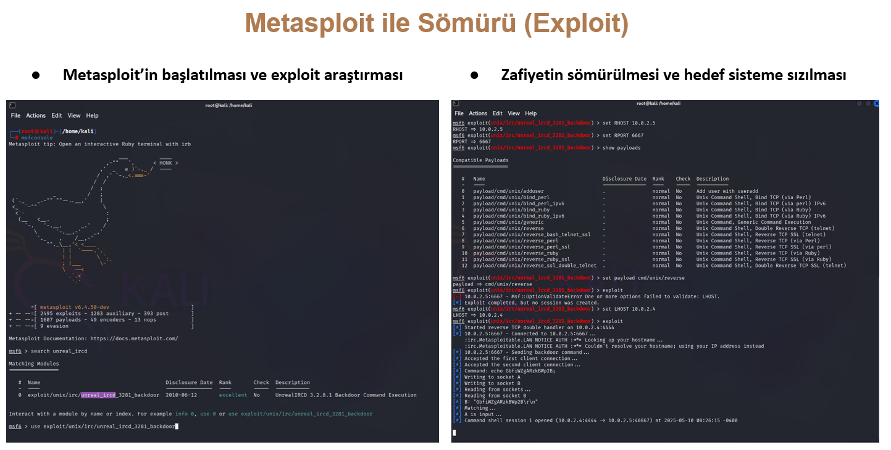

### 💣 9. Shell and File Directory Access
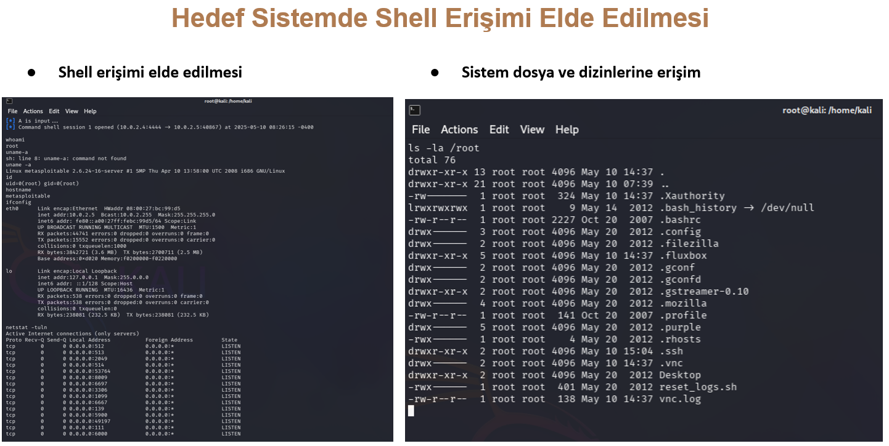

### :information_source: 10. Access to FileZilla and Messaging Application Data
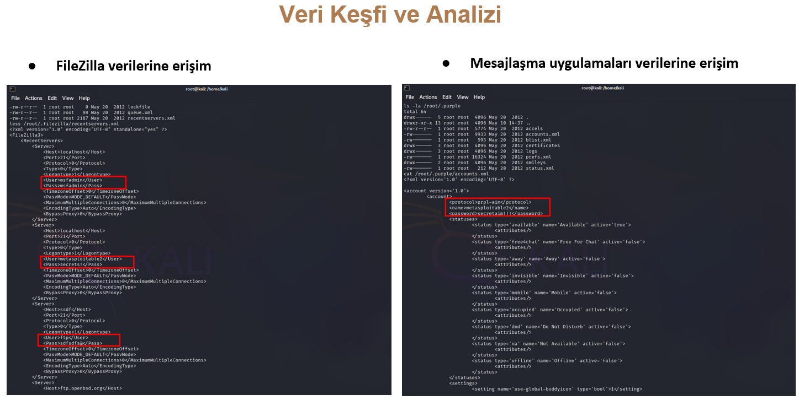

### 📁 11. Access to Mozilla Firefox Browser Data
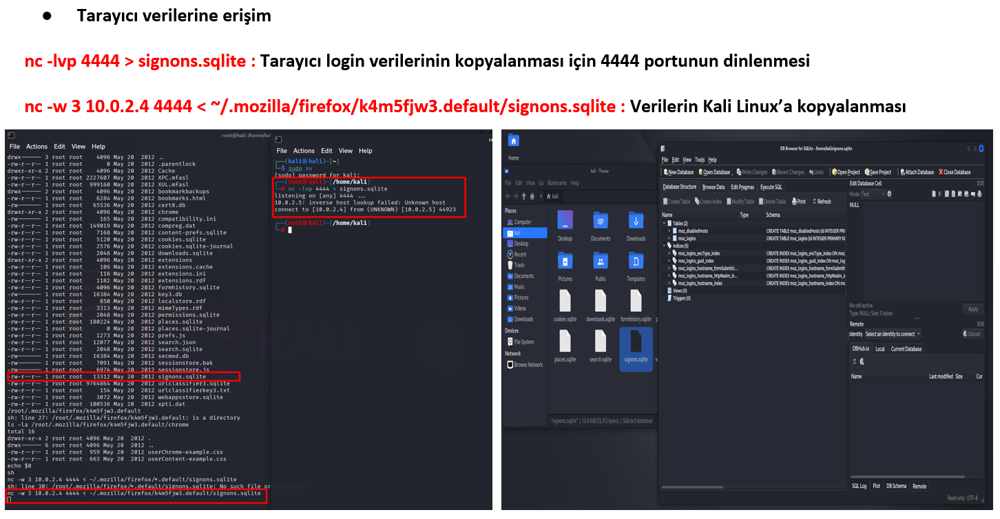

### :information_source: 12. Browser Login and Form data
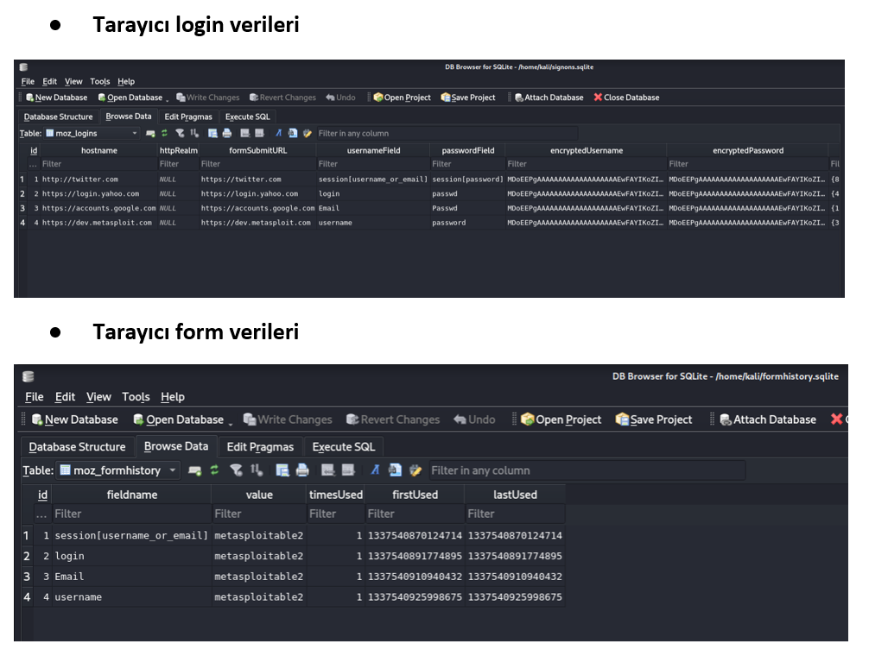

### :cookie: 13. Browser Cookie Data
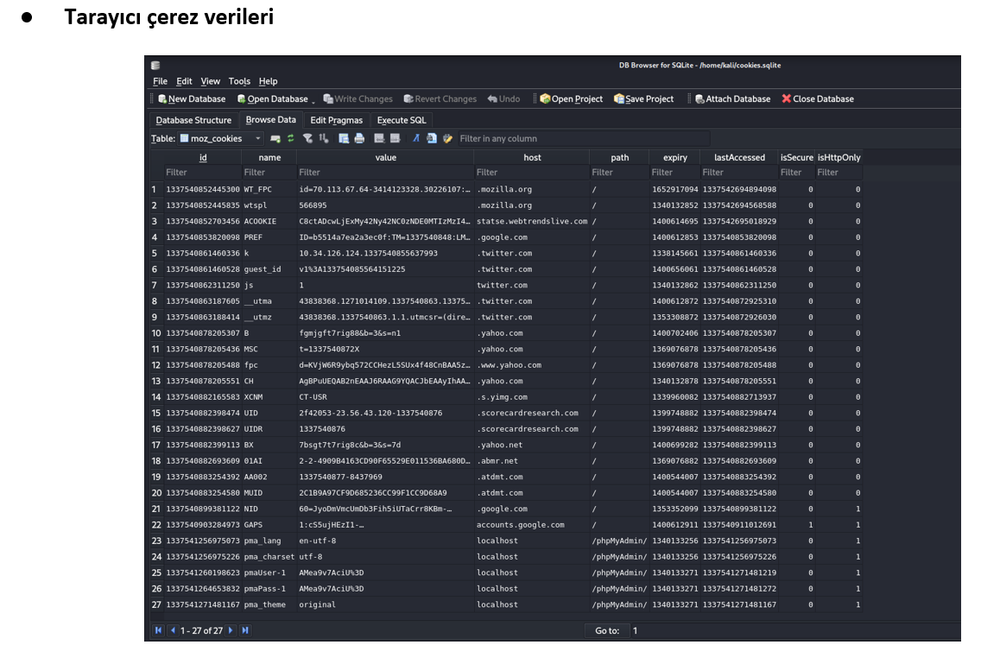

## 📈 Conclusion

- Within the scope of this project, vulnerability analysis, exploitation, and network traffic monitoring were successfully performed on a deliberately vulnerable virtual machine such as Metasploitable 2.
Using the Kali Linux environment, it was thoroughly demonstrated how an attacker can infiltrate systems, which vulnerabilities can be exploited, and how such activities can be monitored over the network.
- Through a vulnerability scan using the Nessus tool, the security weaknesses of the services running on the system were identified.
One such vulnerability was found in the “UnrealIRCd” service running on port 6667, which was successfully exploited using the Metasploit Framework.
As a result, a reverse shell session was obtained, granting full control over the target system.
- With the help of Wireshark, both normal network traffic and the data flow during the exploit process were thoroughly analyzed.
It was observed how the attacker connected to the system and which data packets were transmitted at each stage.
This provided valuable hands-on experience in attack detection and forensic analysis.

## :warning: Recommended Security Measures

- System and Software Updates
- Firewall and Port Management
- Vulnerability Scanning
- User Awareness
- Network Traffic Monitoring
- Log Tracking (Log Monitoring)

